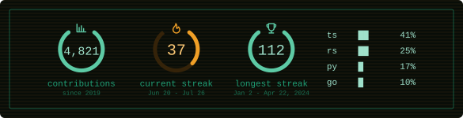
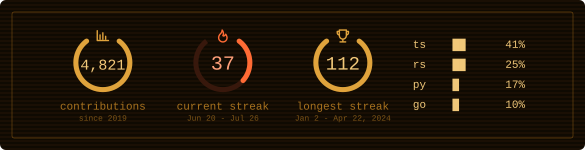
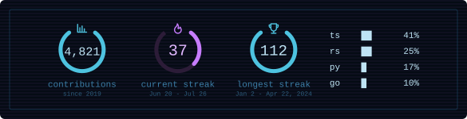
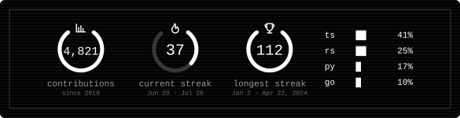
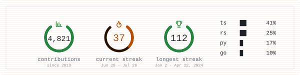
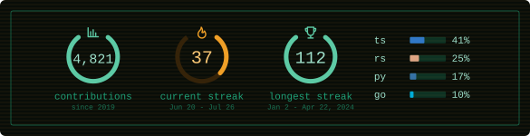
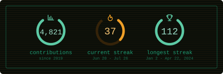

# phosphor-stats

GitHub stats cards for your README. Contributions, streaks and languages, rendered as SVG on the edge.

[](https://github.com/rondrft/phosphor-stats/actions/workflows/ci.yml)
[](LICENSE)
[](https://github.com/rondrft/phosphor-stats/stargazers)



If it is useful to you, [a star](https://github.com/rondrft/phosphor-stats) helps other people find it.

---

## Usage

Paste this into your README and replace `USERNAME` with your GitHub login:

```markdown

```

Or build one visually at **[phosphor-stats.rondrft.workers.dev](https://phosphor-stats.rondrft.workers.dev)** — pick a theme, toggle the modules, copy the snippet.

> The host above is the public instance. If you deploy your own, swap it for your
> own Worker URL and nothing else changes.

Only public data is used, and no account ever needs to authorise anything.

## Themes

Set one with `&theme=`. Individual colours can be overridden on top of any theme.

<table>
<tr><td><code>phosphor</code> <em>(default)</em></td></tr>
<tr><td></td></tr>
<tr><td><code>?theme=amber</code></td></tr>
<tr><td></td></tr>
<tr><td><code>?theme=ice</code></td></tr>
<tr><td></td></tr>
<tr><td><code>?theme=mono</code></td></tr>
<tr><td></td></tr>
<tr><td><code>?theme=light</code></td></tr>
<tr><td></td></tr>
</table>

## Variants

`?lang_style=bars` swaps the block characters for rectangles tinted with each
language's own colour:



`?hide=langs` drops the language column, and the card narrows to fit:



## Parameters

| Parameter | Type | Default | Description |
| --- | --- | --- | --- |
| `username` | string | — | **Required.** A GitHub login. |
| `theme` | string | `phosphor` | `phosphor`, `amber`, `ice`, `mono`, `light`. |
| `ring` | hex | theme | Colour of the contribution and record rings. |
| `accent` | hex | theme | Colour of the streak ring and its icon. |
| `bg` | hex | theme | Card background. Accepts `transparent`. |
| `text` | hex | theme | Colour of the numbers and the language rows. |
| `muted` | hex | theme | Colour of the labels. |
| `border` | hex | theme | Inner frame. `none` hides it. |
| `radius` | 0–24 | `6` | Corner radius of the card. |
| `hide` | csv | — | Modules to omit: `total`, `streak`, `best`, `langs`. |
| `langs_count` | 1–8 | `4` | How many languages to list. |
| `exclude_langs` | csv | — | Languages to leave out, case-insensitive. |
| `lang_style` | string | `blocks` | `blocks` or `bars`. |
| `scanlines` | bool | `true` | CRT banding over the background. |
| `animate` | bool | `true` | Draw-on animation for the rings. |
| `locale` | string | `en` | Label language: `en` or `es`. |
| `show_credit` | bool | `false` | Adds a small project credit to the card. |
| `cache_seconds` | 1800–86400 | `7200` | How long the card may be cached. |

Colours are accepted with or without a leading `#`, in 3, 4, 6 or 8 digits.
Anything that fails validation falls back to the theme rather than breaking the
card. Out-of-range numbers are clamped, not rejected.

The card never returns an error status. A username that does not exist, an
exhausted rate limit or an upstream failure all render as a readable card with a
`200`, because a non-200 in a README shows up as a broken image and tells the
reader nothing.

## Self-hosting

The public instance is **best effort**. It runs on a single GitHub token with a
shared budget of 5,000 requests per hour, and nobody is on call for it. If your
README matters to you, run your own — it takes about five minutes and gives you
your own budget.

**→ [docs/self-hosting.md](docs/self-hosting.md)**

```bash
git clone https://github.com/rondrft/phosphor-stats
cd phosphor-stats && pnpm install
pnpm wrangler kv namespace create STATS_CACHE   # paste the id into wrangler.toml
pnpm wrangler secret put GITHUB_TOKEN
pnpm wrangler deploy
```

## Known limitations

- **GitHub caches the image.** READMEs are served through Camo, GitHub's image
  proxy. It respects `Cache-Control` but can keep serving an older copy for a
  while after it expires. A card that has not caught up yet is expected
  behaviour, not a bug.
- **Streaks are computed in UTC.** A day boundary has to be drawn somewhere, and
  a Worker runs in whichever data centre is closest to the reader — anything
  derived from local time would give a different answer per continent. If you
  live far from UTC your streak may tick over at an unfamiliar hour.
- **A zero on today does not break your streak.** The day is not over yet. The
  streak only ends once yesterday is also empty.
- **Public repositories only,** and forks are excluded from the language totals
  so that forking a large project does not rewrite your breakdown.
- **Languages are sampled**, not exhaustive: the 300 most recently pushed
  repositories are scanned. Beyond that the percentages do not move visibly, and
  the quota is better spent elsewhere.
- **The hourly quota is shared** on the public instance. When it runs low the
  service starts serving slightly stale cards rather than failing.

## Contributing

Issues and pull requests are welcome — see [CONTRIBUTING.md](CONTRIBUTING.md)
for the layout of the codebase and how to run it locally. Participation is
governed by the [Code of Conduct](CODE_OF_CONDUCT.md).

## Licence

[MIT](LICENSE).

Icons are from [Tabler Icons](https://github.com/tabler/tabler-icons), also MIT
licensed, embedded as paths rather than loaded at runtime.
