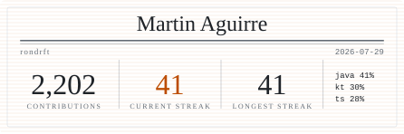
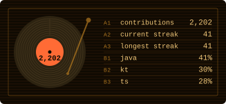
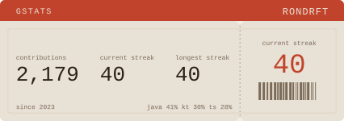

<p align="center">
  
</p>

# phosphor-stats

GitHub stats cards for your README. Contributions, streaks and languages, rendered as SVG on the edge.

[](https://github.com/rondrft/phosphor-stats/actions/workflows/ci.yml)
[](LICENSE)
[](https://github.com/rondrft/phosphor-stats/stargazers)



```markdown

```

That is the whole thing. Replace `USERNAME`, paste it in — no account to connect,
no permission to grant, nothing to authorise. Only public data is used.

> **Already using `phosphor-stats.rondrft.workers.dev`?** It still works, and it
> is not going to stop. The service answers on both hostnames from the same
> deploy and the same cache — the old one is deprecated in the sense that new
> snippets use `gstats`, not in the sense that it has an end date. There is
> nothing to migrate and no reason to edit a README that already works.

If it is useful to you, [a star](https://github.com/rondrft/phosphor-stats)
helps other people find it.

---

## Designs

Six of them, set with `&card=`. Each is shown below in a different theme, but the
two are independent: **any design works with any theme**, and with any colour
override on top. Try combinations at
**[gstats.rondrft.workers.dev](https://gstats.rondrft.workers.dev)**,
which builds the snippet for you.

### `terminal` — three rings and a language column

The default, in the phosphor palette the project is named for.


```markdown

```

### `heatmap` — the trailing year, day by day

The only design that shows something the others cannot. Intensity is graded
against your own distribution, so a quiet year and a busy one both get contrast.



```markdown

```

### `press` — a newspaper front page

Serif, on paper, with the current streak as the one spot of ink colour.



```markdown

```

### `gauge` — an instrument panel

Needles, and no numbers inside the dials. The streak needle measures against your
own record, so full deflection means a personal best in progress.



```markdown

```

### `vinyl` — a record and its tracklist

Turns, once every eight seconds. `&animate=false` stops it.



```markdown

```

### `pass` — a boarding pass

Shown with no named theme at all, only colour overrides — every design takes
them, so you are not limited to the five presets.



```markdown

```

### Themes

`phosphor` *(default)*, `amber`, `ice`, `mono` and `light`, set with `&theme=`.
Any individual colour can be overridden on top of any of them.

A published design never changes and is never removed: the URL in your README is
a promise, and a redesign would silently rewrite a page you are not watching. A
new look ships under a new id.

---

## Options

<details>
<summary><strong>Every parameter</strong></summary>

| Parameter | Type | Default | Description |
| --- | --- | --- | --- |
| `username` | string | — | **Required.** A GitHub login. |
| `card` | string | `terminal` | `terminal`, `heatmap`, `pass`, `press`, `gauge`, `vinyl`. |
| `theme` | string | `phosphor` | `phosphor`, `amber`, `ice`, `mono`, `light`. |
| `ring` | hex | theme | Colour of the contribution and record rings. |
| `accent` | hex | theme | Colour of the streak ring and its icon. |
| `bg` | hex | theme | Card background. Accepts `transparent`. |
| `text` | hex | theme | Colour of the numbers and the language rows. |
| `muted` | hex | theme | Colour of the labels. |
| `border` | hex | theme | Inner frame. `none` hides it. |
| `radius` | 0–24 | `6` | Corner radius of the card. |
| `hide` | csv | — | Modules to omit: `total`, `streak`, `best`, `langs`. |
| `langs_count` | 1–8 | `4` | How many languages to list. |
| `lang_mode` | string | `bytes` | How languages are ranked. See below. |
| `exclude_langs` | csv | — | Languages to leave out, case-insensitive. |
| `include_langs` | csv | — | Re-admit a language from the default exclusions. |
| `lang_style` | string | `blocks` | `blocks` or `bars`. |
| `scanlines` | bool | `true` | CRT banding over the background. |
| `animate` | bool | `true` | Draw-on animation. |
| `locale` | string | `en` | Label language: `en` or `es`. |
| `tz` | IANA zone | Anywhere on Earth | Which midnight ends a day for the streak, e.g. `Europe/Madrid`. |
| `show_credit` | bool | `false` | Adds a small project credit to the card. |
| `cache_seconds` | 1800–86400 | instance default | How long a client may reuse the card. |

Colours are accepted with or without a leading `#`, in 3, 4, 6 or 8 digits.
Anything that fails validation falls back to the theme rather than breaking the
card, and out-of-range numbers are clamped rather than rejected.

The card renders every failure rather than signalling it. A username that does
not exist, an exhausted GitHub quota or an upstream failure all come back as a
readable card with a `200` — a non-200 in a README shows up as a broken image
and tells the reader nothing.

One exception: a client that goes over the instance's rate limit gets a `429`
with `Retry-After`, because that answer is for whoever is making the requests
rather than for a reader. It is still a drawn card, so it says what happened to
anybody who opens it.

</details>

<details>
<summary><strong>How languages are counted</strong></summary>

Summing bytes across an account measures how much code exists, which is not what
a reader thinks they are looking at. One generated stylesheet, one vendored
dependency or one committed bundle outweighs a year of deliberate work. Three
corrections are applied by default:

- **No repository contributes more than 15%** of the ranking. A monorepo still
  counts for more than a scratch project; it just cannot decide the card by
  itself. The cap engages once an account has enough repositories for it to be
  satisfiable — below seven it would only flatten everything to equal shares.
- **Recent work counts for more.** A repository pushed to in the last six months
  counts fully, one within a year counts half, anything older a quarter.
- **By-product languages are excluded**: `HTML`, `CSS`, `SCSS`, `Dockerfile`,
  `Makefile`, `Shell`, `Batchfile`, `Roff`, `TeX` and `Jupyter Notebook`. Bring
  any of them back with `include_langs`, and remove more with `exclude_langs`.
  Anything under 0.5% is dropped as noise.

None of this measures skill or effort, and it could not. It is a heuristic tuned
to be wrong less often than raw byte counts are.

`lang_mode=repos` ignores size entirely and counts the repositories each language
leads. It is cruder, and for a lot of profiles closer to the truth — a portfolio
of eight small Rust services and one enormous inherited Java monolith reads very
differently under the two.

```markdown


```

Bar length is scaled against the leading language, so the leader fills its row.
The percentage beside it is the true share of the total.

</details>

---

## Known limitations

Worth reading before opening an issue — most of these are inherent rather than
fixable.

- **GitHub caches the image and it cannot be purged from outside.** READMEs are
  served through Camo. A card is at best `max-age` behind, which is 30 minutes.
  About half an hour is achievable for an embedded card; "instant" is not, for
  anybody. Opening the `/api` URL directly bypasses Camo and shows the current
  figures.
- **A new day can take a few hours to show up.** Streaks are counted against
  **Anywhere on Earth** (UTC−12), the last zone on the planet to change date, so
  a day counts for as long as it is still that day somewhere. That is the safe
  direction: your streak is never cut short before your own day is over, at the
  price of a new one taking up to twelve hours to be picked up. Pass
  `&tz=Europe/Madrid` — any IANA zone — to have it counted in yours exactly.
- **A zero on today does not break your streak.** The day is not over yet. The
  streak only ends once yesterday is also empty.
- **Public repositories only**, and forks are excluded from the language totals
  so that forking a large project does not rewrite your breakdown.
- **Languages are sampled**, not exhaustive: the 300 most recently pushed
  repositories are scanned. Beyond that the percentages do not move visibly.
- **The public instance is best effort.** One GitHub token shared by everyone
  using it, and nobody is on call for it.
- **Requests are limited per address.** Thirty a minute, and twenty *distinct*
  usernames an hour — a card in a README is one request every half hour, so
  ordinary use never approaches either. Reloading the same profile is free once
  it has been counted; walking a list of usernames is what the second limit is
  for. Over the line gets a card that says `too many requests` and a
  `Retry-After`. A [self-hosted instance](docs/self-hosting.md#7-protect-your-quota)
  sets its own numbers.

### Private repositories

**This service cannot see them, and should not be able to.** A GitHub token
reaches exactly what its owner reaches, so a third party's private repositories
are unreachable, without exception. Giving the shared token private access would
publish the language breakdown of the private code belonging to whoever
configured it — a leak wearing a feature's clothes.

What does work: [self-host](docs/self-hosting.md#private-repositories) with your
own token and restrict the instance to your own username.

Separately, and worth knowing: turning on **Settings → Profile → Include private
contributions on my profile** makes your contribution total count private work
without revealing anything about it. It costs nothing and a lot of people do not
know it exists.

---

## Running your own

About five minutes, and it fits inside the Cloudflare free tier.

```bash
git clone https://github.com/rondrft/phosphor-stats
cd phosphor-stats && pnpm install
pnpm wrangler kv namespace create STATS_CACHE   # paste the id into wrangler.toml
pnpm wrangler secret put GITHUB_TOKEN
pnpm deploy
```

**→ [docs/self-hosting.md](docs/self-hosting.md)** for the full walkthrough:
tokens, KV, rate limiting, continuous deployment and monitoring.

Your own instance can also keep cards current, which the public one cannot do on
your behalf:

- `POST /purge?username=<login>` drops a cached profile so the next view
  refetches. There is a GitHub Action that calls it on every push.
- `WARM_USERS` refreshes up to ten profiles every fifteen minutes, so those cards
  never wait on a cache miss.

**→ [docs/purging.md](docs/purging.md)**, which also sets out how fresh a card
can honestly be.

---

## Contributing

Issues and pull requests are welcome — see [CONTRIBUTING.md](CONTRIBUTING.md)
for the layout of the codebase and how to run it locally. Participation is
governed by the [Code of Conduct](CODE_OF_CONDUCT.md).

Before changing anything that looks arbitrary, read
[docs/decisions.md](docs/decisions.md): most of the odd-looking choices here are
working around something, and several were written the obvious way first and
corrected once a test proved the obvious way was wrong.

- [CHANGELOG.md](CHANGELOG.md) — what changed and when. Worth a look if a card
  you published starts showing a different figure.
- [docs/decisions.md](docs/decisions.md) — why things are the way they are.
- [docs/limits.md](docs/limits.md) — the quota arithmetic. The ceiling is KV
  writes, not the GitHub quota.
- [docs/pending.md](docs/pending.md) — what is missing, in priority order.

## Licence

[MIT](LICENSE). Icons from [Tabler Icons](https://github.com/tabler/tabler-icons),
also MIT, embedded as paths rather than loaded at runtime.
